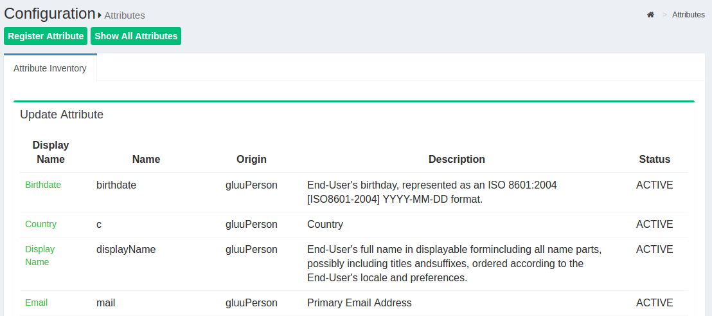
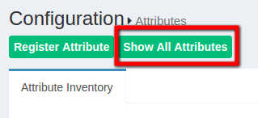
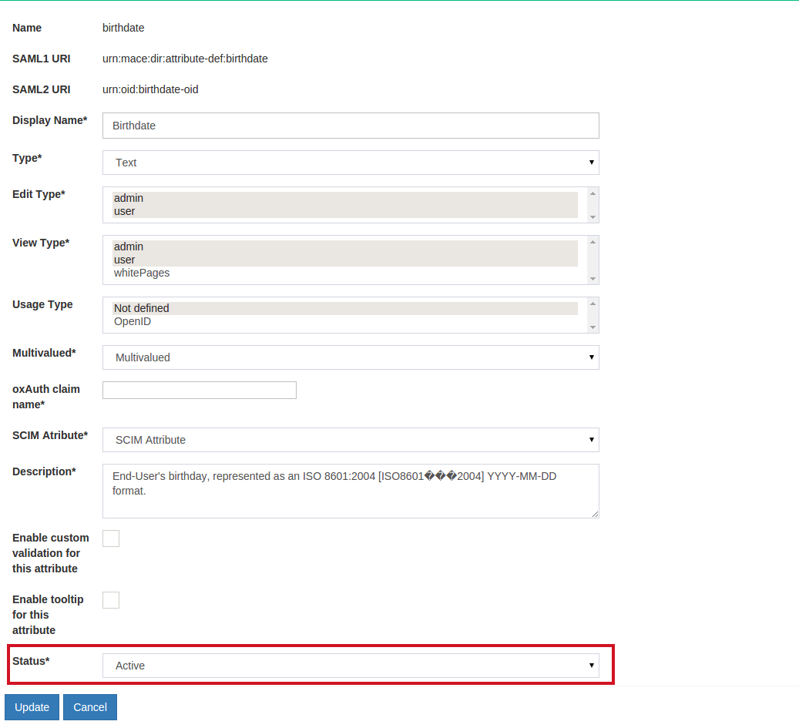
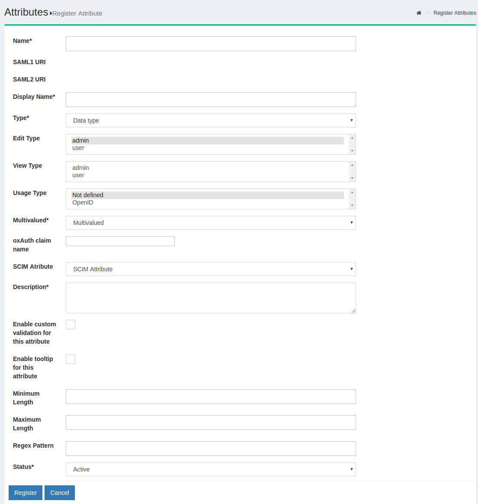

# Attributes

## Overview
An list of *Active* attributes can be seen from the Configuration > Attributes section.



The Gluu Server has a large LDAP tree which includes all standard
attributes. It is not necessary for all of them to be *Active*. The
active LDAP trees can be sorted using the *Show only Active Attributes*
link.



The Gluu Server administrator can make changes to attributes, such as changing their
status to active/inactive, by clicking on a specific attribute.




## Custom Attributes
Additional custom attributes can be added in below way

 - Become user 'ldap' 
 - Add custom attribute to /opt/gluu/schema/openldap/custom.schema 
   - In this below example 'customTest' is our custom attribute : 
```
attributetype ( oxAttribute:1003 NAME 'customTest'
        SUBSTR caseIgnoreSubstringsMatch EQUALITY caseIgnoreMatch
        SYNTAX 1.3.6.1.4.1.1466.115.121.1.15        
       X-ORIGIN 'Gluu - custom person attribute' )
```
 - Add custom attribute to gluuCustomPerson objectClass
   - Example: 
```
objectclass ( 1.3.6.1.4.1.48710.1.4.101 NAME 'gluuCustomPerson'
        SUP ( top )
        AUXILIARY
        MAY ( telephoneNumber $ mobile $ customTest )
        X-ORIGIN 'Gluu - Custom persom objectclass' )
```
 - Become user 'root'
 - Stop LDAP server with command `service solserver stop`
 - Test custom configuration with `/opt/symas/bin/slaptest -f /opt/symas/etc/openldap/slapd.conf`
 - Start LDAP server with command `service solserver start`

Register new attribute with Gluu Server GUI, oxTrust, by
clicking the **Register Attribute** button. Then, the following screen will
appear:



* _Name:_ This field defines the name of the custom attribute which must
  be unique in the Gluu Server LDAP tree.

* _SAML1 URI:_ This field contains the SAML1 uri for the custom attribute.

* _SAML2 URI:_ This field contains the SAML2 uri for the custom attribute.

* _Display Name:_ This display name can be anything that is human readable.

* _Type:_ The attribute type should be selected from the drop-down menu.
  There are four attribute types supported by Gluu:
  1. Text
  2. Numeric
  3. Photo
  4. Date

* _Edit Type:_ This field controls which type of an user is allowed to edit
  corresponding attribute at his/her "Profile" page of the web UI (when feature
"User can edit own profile" is enabled).

* _View Type:_ This field controls which type of an user is allowed to view
  corresponding attribute at his/her "Profile" page of the web UI.

* _Privacy Level:_ Please select the desired privacy level from the
  drop-down menu. The privacy level has a specific range of 1 to 5.

* _Multivalued:_ Please select multivalue in this field if the attribute
  contains more than one value.

* _SCIM Attributes:_ If the attribute is a part of SCIM architecture select true.

* _Description:_ This contains a few words to describe the attribute.

* _Status:_ The status, when selected active, will release and publish
  the attribute in IdP.


## SAML Attributes

In any SAML SSO transaction, your Gluu Server will need to release attributes about users to the target SP. Learn more about SAML attributes in the [SAML section of the documentation](./saml.md). 


# OpenID Connect Scopes

In OpenID Connect, scopes are used to group attributes and provide a human 
understandable description of the attributes. This improves usability when you need 
to prompt a person to approve the disclosure of attributes to a third party. Learn more about OpenID Connect scopes in the [OpenID Connect section of the documentation](./openid-connect.md)
