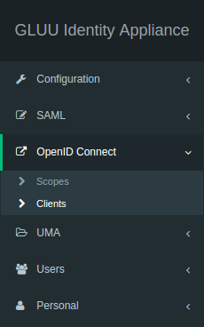
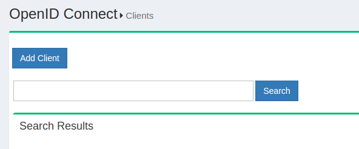
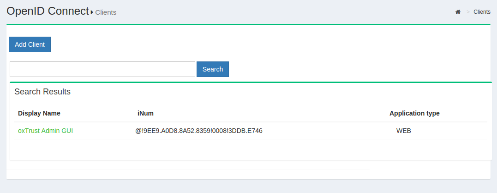
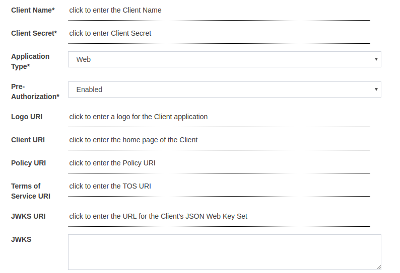
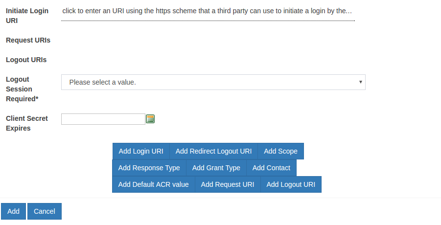
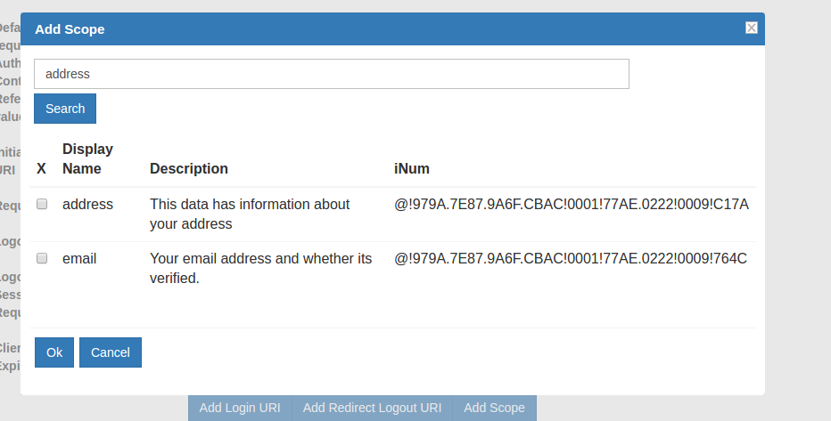
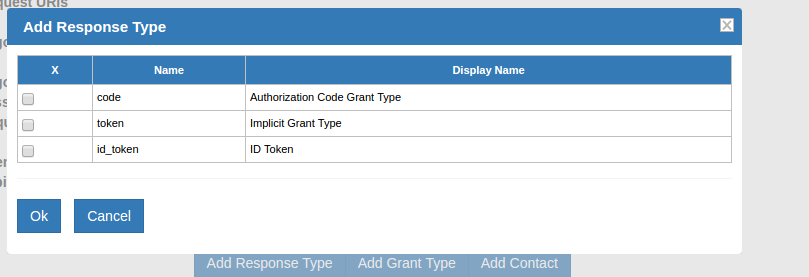

## OpenID Connect Client

A client in OAuth2 could be either a website or mobile application.
OpenID Connect has an API for [Dynamic Client
Registration](http://openid.net/specs/openid-connect-registration-1_0.html)
which efficiently pushes the task to the application developer. If you
do not want to write an application to register your client, there are a
few web pages around that can do the job for you. Gluu publishes the
[oxAuth-RP](https://ce-dev.gluu.org/oxauth-rp) and there is also another in [PHP
RP](http://www.gluu.co/php-sample-rp).

A new client can be added by clicking the **Add Client** link.

Available **Clients** can be seen by hitting the **Search** button
leaving the search box empty.

### Register Client
Gluu Server Administrators can click on the `Add Client` button to register new clients. It is possible to dynamically register any client by calling the dynamic registration endpoint, but this section focuses on the manual registration of the client. The following screen appears when the `Add Client` button is clicked.

* _Client Name:_ This contains the recognizable and unique display name
  of the client. The name of the Client to be presented to the End-User.

* _Client Secret:_ This is the Data Encryption Standard scheme used by
  Confidential Clients to authenticate to the token endpoint. The value for the secret can be inserted manually.

* _Application Type:_ There are two types of applications, Web and
  Native.

	* _Web:_ The Dynamic Client Registration is the default for web. In this type the redirect_uri for implicit grant type must be a real
    hostname with HTTPS. This type is not approved any localhost or HTTP. The web application uses the authorization code flow for clients which
    can maintain a client secret between the uris and the authorization
    server.

	* _Native:_ Custom uri for Native type application have to follow HTTP with localhost. This is suitable for a mobile app which cannot maintain the client secret between itself and the authorization server.

* _Pre Authorization:_ Allow pre-authorized Client Applications 

* _Logo URI:_ The URL of the logo for the client application.
  If present, the server will display this image to the End-User during approval.

* _Client URI:_ The URL of the home page of the client.

* _Policy URI:_ The URL of the Privacy policy.

* _Terms of Service URI:_ The URL to the Terms of Use of the Client.

* _JWKS URI:_ The URL for the Client's JSON Web Key Set.
  
* _JWKS:_ The value of  Client's JSON Web Key Set. The jwks_uri and jwks parameters MUST NOT be used together.

* _Sector Identifier URI:_ URL using the https scheme to be used in calculating Pseudonymous Identifiers by the OP.
  The URL references a file with a single JSON array of redirect_uri values.
  
* _Subject Type:_ The subject type requested for responses to this Client.

* _JWS alg Algorithm for signing the ID Token:_ JWS alg algorithm for signing the ID Token issued to this Client.
  See [Algorithms section](#algorithm) for options.

* _JWE alg Algorithm for encrypting the ID Token:_ JWE alg algorithm for encrypting the ID Token issued to this Client.
  See [Algorithms section](#algorithm) for options.

* _JWE enc Algorithm for encrypting the ID Token:_ JWE enc algorithm for encrypting the ID Token issued to this Client.
  See [Algorithms section](#algorithm) for options.

* _JWS alg Algorithm for signing the UserInfo Responses:_ JWS alg algorithm for signing UserInfo Responses.
  If this is specified, the response will be JWT serialized, and signed using JWS.
  See [Algorithms section](#algorithm) for options.

* _JWS alg Algorithm for encrypting the UserInfo Responses:_  JWE alg algorithm for encrypting UserInfo Responses.
  See [Algorithms section](#algorithm) for options.

* _JWE enc Algorithm for encrypting the UserInfo Responses:_ JWE enc algorithm for encrypting UserInfo Responses. 
  See [Algorithms section](#algorithm) for options.

* _JWS alg Algorithm for signing Request Objects:_ JWS alg algorithm used for signing Request Objects sent to the OP.
  This algorithm is used when the Request Object is passed by value (using the request parameter) and when it is
  passed by reference (using the request_uri parameter).
  The value none can be used.
  See [Algorithms section](#algorithm) for options.

* _JWE alg Algorithm for encrypting Request Objects:_ JWE alg algorithm the RP is declaring that it use for
  encrypting Request Objects sent to the OP.
  See [Algorithms section](#algorithm) for options.

* _JWE enc Algorithm for encrypting Request Objects:_ JWE enc algorithm the RP is declaring that it may use for
  encrypting Request Objects sent to the OP.
  See [Algorithms section](#algorithm) for options.

* _Authentication method for the Token Endpoint:_ Requested Client Authentication method for the Token Endpoint.
  The options are client_secret_post, client_secret_basic, client_secret_jwt, private_key_jwt, and none.
  If omitted, the default is client_secret_basic, the HTTP Basic Authentication Scheme.

* _JWS alg Algorithm for Authentication method to Token Endpoint:_ JWS alg algorithm used for signing the JWT
  used to authenticate the Client at the Token Endpoint for the private_key_jwt and client_secret_jwt
  authentication methods. The value none cannot be used.
  See [Algorithms section](#algorithm) for options.

* _Default Maximum Authentication Age:_ Specifies that the End-User must be actively authenticated if the End-User was
  authenticated longer ago than the specified number of seconds.
  If omitted, no default Maximum Authentication Age is specified.

* _Require Auth Time:_ Specifies whether the auth_time Claim in the ID Token is required.
  If omitted, the default value is false.

* _Persist Client Authorizations*:_ Specifies whether to persist user authorizations.

* _Initiate Login URI:_ URI using the https scheme that a third party can use to initiate a login by the RP.

* _Request URIs:_ Array of request_uri values that are pre-registered by the RP for use at the OP.
   The Server cache the contents of the files referenced by these URIs and not retrieve them at the time they are used in a request.

* _Logout URIs:_ Redirect logout URLs supplied by the RP to which it can request that the End-User's
  User Agent be redirected using the post_logout_redirect_uri parameter after a logout has been performed.

* _Logout Session Required*:_ Specifies whether the RP requires that a sid (session ID) query parameter
  be included to identify the RP session at the OP when the logout_uri is used.
  If omitted, the default value is false.

* _Client Secret Expires:_ Time at which the client will expire or 0 if it will not expire.

* _Add Login URI:_ This option can be used to add the login URL.

* _Add Redirect Logout URI:_ The logout request, if requires a redirection can be added here.

* _Add Scopes:_ This option can be used to add the required scopes in the Gluu Server.
The available scopes can be listed by hitting the *Search* button, and
  keeping the search phrase blank. Furthermore, from this the Gluu Server administrator can select the required scopes.

* _Add Response Type:_ There are three types of responses in the Gluu
  Server and they are Code, Token and ID Token. The Gluu Server
  Administrator can select all of them for testing purposes.

* _Add Grant Type:_ There are 3 grant type available in this option `authorization_code, implicit, refresh_token`

* _Add Contact:_ Use this option to add the email address for the Client contact

* _Add Default ACR value:_ The default ACR Value is defined through this option and it is used to include multi-factor authentication in registered clients. Please use this option to define which from of authentication to use for specific client. See section 3.3.2.1 for details.

* _Add Request URI:_ Use this option to add the Request URI

* _Add Logout URI:_ Use this option to add the logout URI.

### Multi-Factor Authentication for Clients
The `acr_values` parameter is used to specify the use of specific multi-factor authentication for each client. If a scenario is presented where different clients use different authentication mechanism, then the `acr_value` parameter is used to specify the choice. Out of the box, GLuu Server supports U2F, DUO, Basic, oxPush/SuperGluu, Google+ and internal LDAP authentication. While registering new clients, put the mode in `Add Default ACR value` to chosen mechanism. The authentication mechanism must be enabled in the `Custom Scripts` section as well.

!!! Note
    Supported ACR Values in Client Registration: "u2f", "duo", "basic", "mt", "oxpush2", "gplus", "internal"

The values appear in order of preference and the successful authentication is sent as the acr claim value in the issued ID Token. The table below explains the acr values. Please click on the description to access the specific how-to guide for the ACR declared authentication.

|  ACR Value  	| Description			|
|---------------|-------------------------------|
|  u2f		| [FIDO U2F Device](../multi-factor/u2f)|
|  duo		| [Duo soft-token authentication](../multi-factor/duo)|
|  basic	| Username/Password authentication from LDAP Server|
|  oxpush2	| [Multi-factor authentication](../multi-factor/oxpush2)|
|  gplus	| [Google+ authentication](../customize/social-login-google)|
|  internal	| Use Gluu Server LDAP to authenticate users|

### Algorithm
oxAuth supports various types of signature and encryption
algorithms for authorizing request parameter passing, ID token signature
and encryption, signing return responses, Encrypt User Info Endpoints
etc.

**Note:** It is a good practice to implement ID Token Signatures with the RSA
SHA-256 algorithm (algorithm value RS256). Additionally, oxAuth also
supports other algorithms that are listed below.

_Available Signature Algorithms:_ none, HS256, HS384, HS512, RS256, RS384, RS512, ES256, ES384, ES512.

_Encryption, Key Encryption Algorithms:_ RSA1_5, RSA-OAEP, A128KW, A256KW.

_Block Encryption Algorithms:_ A128CBC+HS256, A256CBC+HS612, A128GCM, A256GCM,

## Custom Client Registration

Using interception scripts you can customize client registration
behavior. For example, by default oxAuth allows new clients to access to
default scopes only. With a custom client registration interception
script it is possible to allow access to more scopes. For instance, we
can use `redirect_uri` to determine if we need to allow access to
additional scopes or not.

To access the interface for custom scripts in oxTrust, navigate to
Configuration --> Custom Scripts --> Custom Client Registration.

The script is [available here](./sample-client-registration-script.py)

