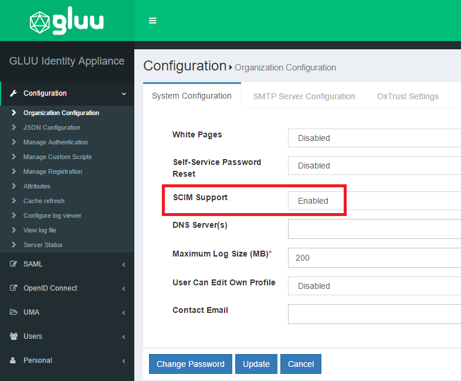
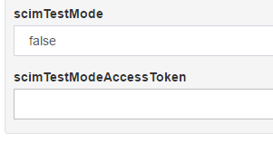
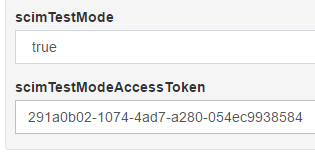
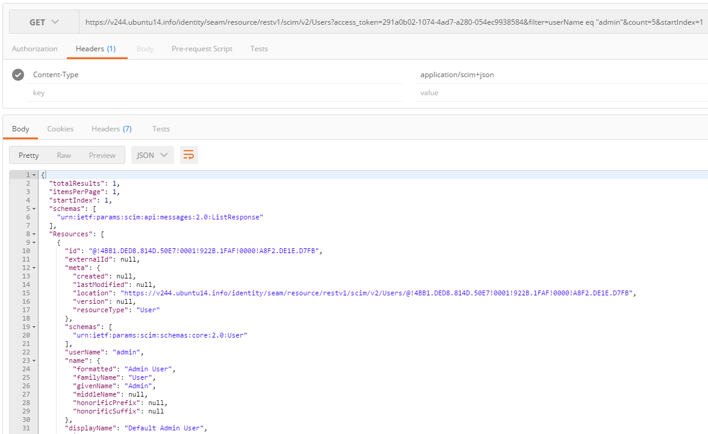
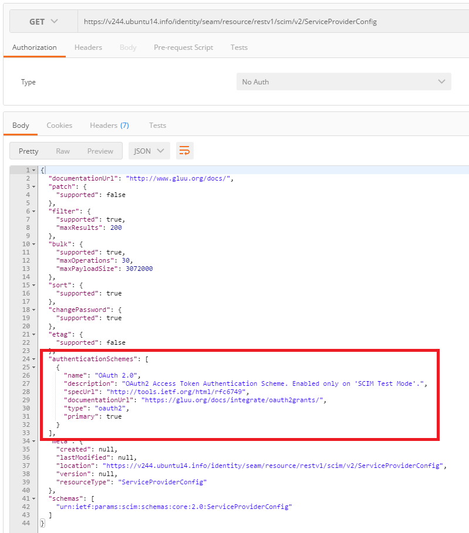
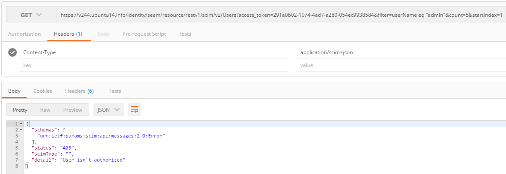

# Overview
The Gluu Server supports UMA protection for SCIM endpoints from Gluu Server CE 2.4.0 and onward. 
A machine based authorization method is used to obtain access tokens. SCIM/UMA is built
into the Gluu Server CE and does not require any special package or installation. 

##Installation

* Install Gluu Server CE following the [Installation Guide](../installation-guide/index.md). The setup script prepares the 
configuration necessary for SCIM UMA RS endpoints and SCIM UMA RP client 
and [this template](https://github.com/GluuFederation/community-edition-setup/blob/master/templates/scim.ldif) 
is used. 

**Note:** The JWKS for RS and RP clients are put into the `./output/scim.ldif` file ready for SCIM configuration.
The `setup.properties.file` contains the RS and RP JWKS in Base64 format.

* Use the following command to extract OpenID SCIM RS and RP Client ID
` cat setup.properties.last | grep "scim_rs_client_id\|scim_rp_client_id"`

* The UMA SCIM client requires JWKS, so the setup script extracts the JWKS from `setup.properties.last` and puts it into the `./output/scim-rp.jks` file.

**_NOTE:_ For versions before v2.4.4, the JWKS is put in the `./output/scim-rp-openid-keys.json` file instead.**

##Configuration

* Enable SCIM from Organization Configuration



* oxTrust SCIM UMA configuration is automatically updated while running 
the `setup.py` and the correct values are setup 
in the [oxtrust-config.json](https://github.com/GluuFederation/community-edition-setup/blob/master/templates/oxtrust-config.json#L122) file.
```
  "umaIssuer":"https://%(hostname)s",
  "umaClientId":"%(scim_rs_client_id)s",
  "umaClientKeyId":"",
  "umaResourceId":"1447184268430",
  "umaScope":"https://%(hostname)s/oxauth/seam/resource/restv1/uma/scopes/scim_access",
  "umaClientKeyStoreFile":"%(scim_rs_client_jks_fn)s",
  "umaClientKeyStorePassword":"%(scim_rs_client_jks_pass_encoded)s",
```

* `umaClientKeyId` can be updated with the `alias` from `scim-rp.jks` file; if it is not updated, the first key from the file is used automatically.

##Testing SCIM UMA
The following is a sample code that can be run to test the configured SCIM 
UMA Gluu CE. It uses [SCIM-Client](https://github.com/GluuFederation/SCIM-Client), 
a Java library also developed by Gluu intended for client applications.

* If you are using Maven, below is how to add SCIM-Client to your project:
```
<repositories>
  <repository>
    <id>gluu</id>
    <name>Gluu repository</name>
    <url>http://ox.gluu.org/maven</url>
  </repository>
</repositories>
...
<dependency>
  <groupId>gluu.scim.client</groupId>
  <artifactId>SCIM-Client</artifactId>
  <version>${scim.client.version}</version>
</dependency>
```

* Starting with Release v2.4.2, an SCIM-Client must be used on a matching Gluu CE. For example, if you are running CE v2.4.4, you must also use SCIM-Client v2.4.4.

* Add your domain's SSL certificate to the JRE's `cacerts` certificate key store where your client application will run. There are lots of articles around the Web on how to do this.

* Supply the UMA parameters and run the code. **_NOTE:_ If you have re-installed Gluu CE, please note that the UMA parameters / JWKS files are also regenerated. You must then rebuild your client code with `target` or `tmp` folders possibly cleared beforehand to avoid conflicts.**

```

package gluu.scim.client.dev.local;
 
import gluu.scim.client.ScimClient;
import gluu.scim.client.ScimResponse;
import gluu.scim2.client.Scim2Client;
 
import java.io.IOException;
 
import javax.ws.rs.core.MediaType;
import javax.xml.bind.JAXBException;
 
import org.codehaus.jackson.JsonGenerationException;
import org.codehaus.jackson.map.JsonMappingException;
 
public class TestScimClient {
 
	private static void testScim1Uma(String domain, String umaMetaDataUrl, String umaAatClientId, String umaAatClientJksPath, String umaAatClientJksPassword, String umaAatClientKeyId) throws IOException, JsonGenerationException, JsonMappingException, JAXBException {
	
		final ScimClient scimClient = ScimClient.umaInstance(domain, umaMetaDataUrl, umaAatClientId, umaAatClientJksPath, umaAatClientJksPassword, umaAatClientKeyId);
 
		ScimResponse response = scimClient.personSearch("uid", "admin", MediaType.APPLICATION_JSON);
		System.out.println("SCIM1 " + response.getResponseBodyString());
	}
 
	private static void testScim2Uma(String domain, String umaMetaDataUrl, String umaAatClientId, String umaAatClientJksPath, String umaAatClientJksPassword, String umaAatClientKeyId) throws IOException, JsonGenerationException, JsonMappingException, JAXBException {
	
		final Scim2Client scim2Client = Scim2Client.umaInstance(domain, umaMetaDataUrl, umaAatClientId, umaAatClientJksPath, umaAatClientJksPassword, umaAatClientKeyId);
 
		String filter = "userName eq \"admin\"";
		ScimResponse response = scim2Client.searchUsers(filter, 1, 1, "", "", null);
		System.out.println("SCIM2: " + response.getResponseBodyString());
	}
 
	public static void main(String[] args) throws IOException, JAXBException {
	
		final String domain = "https://c67.gluu.info/identity/seam/resource/restv1";
		final String umaMetaDataUrl = "https://c67.gluu.info/.well-known/uma-configuration";
		final String umaAatClientId = "@!A410.188A.95DD.EA5A!0001!3A1E.BAA5!0008!5870.A795";
 
		final String umaAatClientJksPath = "D:\\Development\\test_data\\scim\\scim-rp.jks";
		final String umaAatClientJksPassword = "secret";
		final String umaAatClientKeyId = "";
 
		testScim1Uma(domain, umaMetaDataUrl, umaAatClientId, umaAatClientJksPath, umaAatClientJksPassword, umaAatClientKeyId);
		testScim2Uma(domain, umaMetaDataUrl, umaAatClientId, umaAatClientJksPath, umaAatClientJksPassword, umaAatClientKeyId);
    }
}

```

## SCIM 2.0 Test Mode (v2.4.4+)

Starting with CE v2.4.4, the "test mode" configuration will help developers test the SCIM 2.0 endpoints easier. Instead of UMA + SCIM-Client, in test mode a long-lived OAuth2 access token issued by the Gluu server is used to authorize with the SCIM 2.0 endpoints.

To enable test mode, do the following:

* Login to the oxTrust GUI  
* Navigate to `Configuration` > `JSON Configuration` > `OxTrust Configuration`, 
then locate the property `scimTestMode`.



* Set it to `true`.
* click the `Save Configuration` button. 
The Gluu server will then create a long-lived OAuth2 access token with a 
validity period of one year. Doing this will also switch the authentication 
scheme from UMA to OAuth2 Access Token.
* Click on  `JSON Configuration` > `OxTrust Configuration` in the left navigation pane. 
This will retrieve the access token and be displayed in the `scimTestModeAccessToken` property.



* If the access token has expired, just repeat the previous steps to create a new one.
 
The access token can then be used as the query string 
parameter `access_token` in accessing the SCIM 2.0 endpoints, for example:



You can verify the current authentication scheme of the SCIM 2.0 
endpoints by browsing its `ServiceProviderConfig`:



To exit test mode, just set `scimTestMode` back to `false` then 
* click the `Save Configuration` button. This will switch the 
authentication scheme from OAuth2 Access Token to UMA. If you try using 
your access token again, you will now get the `403 Unauthorized` error:



# Notes
UMA is protected with SCIM in Gluu Server Community Edition (CE). 
The usage of UMA requires HTTP GET and HTTP POST requests. Before testing, 
the Client making the requests must be added/registered in Gluu CE. The UMA 
configuration is available @ `https://hostname/.well-known/uma-configuration`. 
The request to authorization endpoint must accompanied with  application/json content type. 

The example below shows the parameters used in a real-life use case  where the 
UMA RPT Token is authorized in oxAuth.

```
    public RptAuthorizationResponse requestRptPermissionAuthorization(@HeaderParam("Authorization") String authorization,
            @HeaderParam("Host") String amHost, RptAuthorizationRequest rptAuthorizationRequest);
```

If the default openID SCIM Client is not used, the `inum` must be added to the
UMA Authorization Policy Custom Script.
