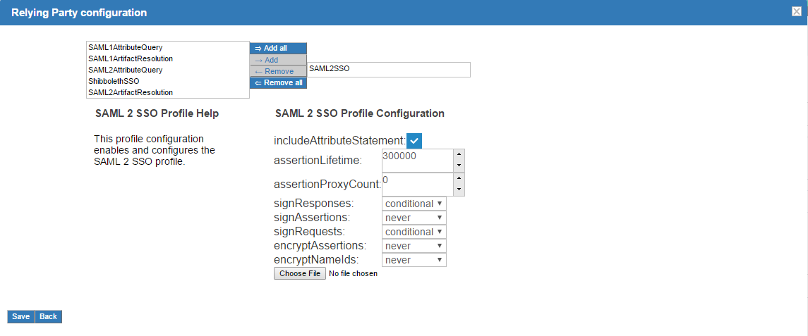
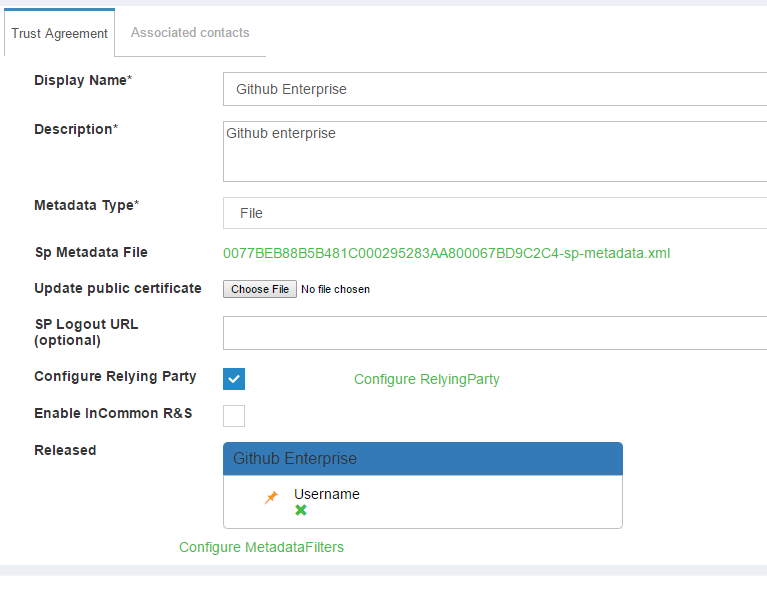
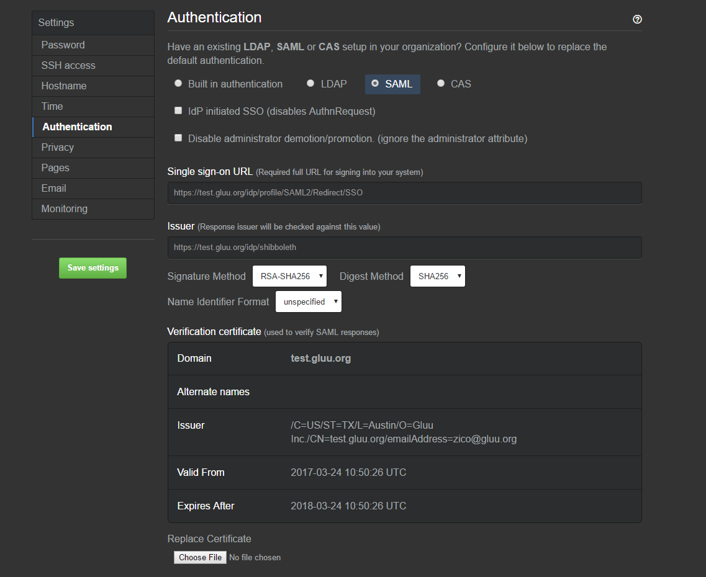
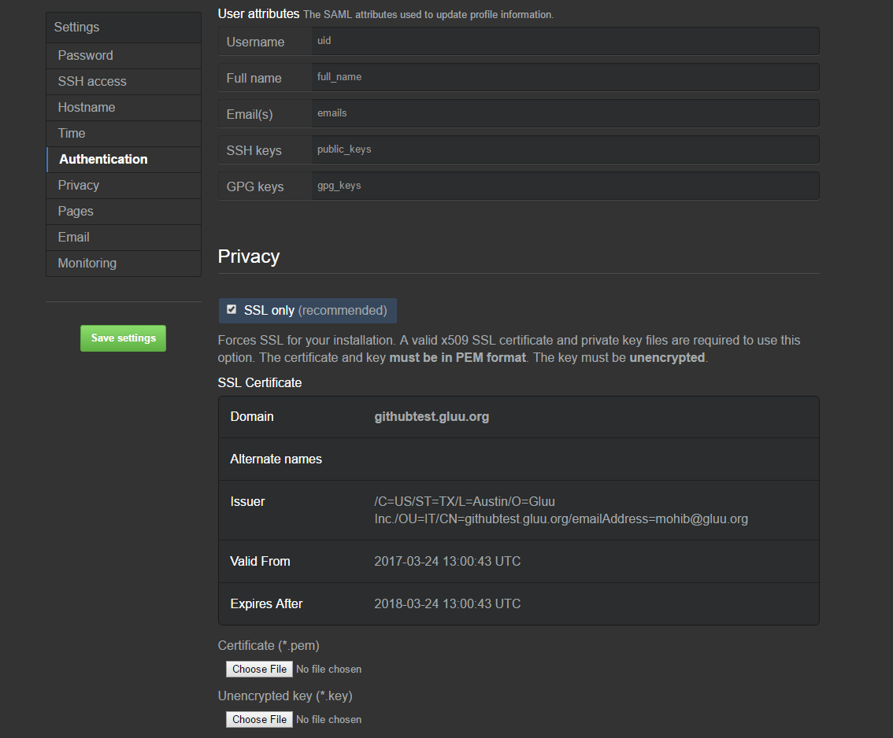

# Github Enterprise SSO with Gluu Server

## Configuration in Gluu Server

### Metadata from Github Enterprise
   - Grab the metadata from `http(s)://[hostname]/saml/metadata` location. Your `hostname` is provided upon acquiring your Github Enterprise license. 
   - Remove `validUntil="20xx-xx-xxTyy:57:26Z` section from Github metadata.
   - Save it as `github_metadata.xml` .
   
### Create Trust Relationship

   - Log into your Gluu Server UI
   - Navigate to SAML -> Trust Relationship
     - `Add Relationship`
       - Display Name: Github Enterprise
       - Description: File method / External SP / SP-initiated SSO
       - Metadata Type: File
       - SP metadata file: Upload `github_metadata.xml`
       - Configure Relying Party: Yes, SAML2SSO 
       - Released Attribute: Username
       - `Add` 
   

## Configuration in Github Enterprise 

   - Log into Github Enterprise management console. It should be `https://[hostname]:8443/setup/settings`
   - Click on `Authentication`
     - Select `SAML`
     - IdP Initiated SSO: unchecked
     - Disable administrator demotion/promotion: unchecked
     - Signle sign-on URL: https://[hostname_of_Gluu_server]/idp/profile/SAML2/Redirect/SSO
     - Issuer: https://[hostname_of_Gluu_server]/idp/shibboleth
     - Signature Method: RSA-SHA256
     - Digest Method: SHA256
     - Name Identifier Format: unspecified
     - Replace Certificate: Get Shibboleth cert named `shibIDP.crt` from Gluu Server. Location: `inside_container/etc/certs/` 
     And upload this certifiate here
     - User attributes: 
       - Username: uid
       - Full name: full_name
       - Email(s): emails
       - SSH keys: public_keys
       - GPG keys: gpg_keys
   - `Save Settings`
   - Two sample setup from Github Enterprise Management panel: 
      -  
      - 

## Test SSO

SSO to Github Enterprise should be ready now. Just hit the hostname of your Github Enterprise app and you should experience something like this: [https://www.youtube.com/watch?v=rPbsVhGTgxE](https://www.youtube.com/watch?v=rPbsVhGTgxE)
